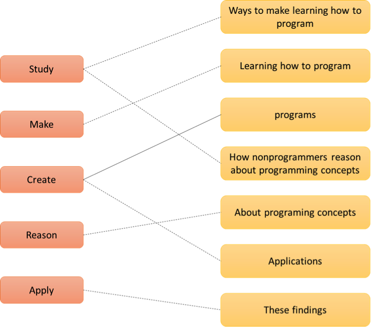

# Logapps-TribeHacks-Challenge-2017
Logapps NLP Problem Statement for TribeHacks 2017

Welcome Hackers,

Logapps invites your team to solve the following two-part problem set within the guidelines. By the end of this exercise, your team will gain knowledge in Natural Language Processing (NLP) and string searching algorithms. No prior knowledge of NLP is required, but teammates should have reasonable programming ability using Python and experience making tables and graphing data structures. 

We suggest TribeHack participants download NLTK (http://www.nltk.org/) and view the Stanford CoreNLP suite of tools (http://stanfordnlp.github.io/CoreNLP/index.html).

Remember, use your imagination and be as creative as you would like!!! ☺ 

Proposed Problem (efficiency of code is expected)
Part 1: Using NLP in Python, decompose the paragraphs and sentences provided in Appendix 1 to identify verbs and their object(s), and export to a table using the same format depicted in Example 1. 
Note: There can be multiple verb-to-object combinations within a single sentence. 
* See Example 1 for clarification. 

Part 2: Using the output from Part 1, use Python to create a verb-to-object matrix identifying the number of combinations per each verb to object. Export the table using the same format depicted in Example 2. 
Note: Each verb to object can be many to many. 
* See Example 2 for clarification. 

Part 3: Create an entity visual/diagram for the output of Part 2. See Example 3.

Extra Credit:
-	Create a User Interface to allow the user to edit the sentences/paragraph that were input (Part 1) into the program/application, then re-execute Part 1 and Part 2.

Business Rules:
1.	Must use Python.
2.	Use NLP to break down the sentences.
3.	Only consider verbs. For example, if “record” is used as a noun in a sentence, do not count it.
4.	Convert verbs to present tense.
5.	Each sentence ends with a period.
6.	Ignore words in between parentheses. 

Example 1 (Part 1 of the Problem)
Input:
The Natural Programming Project will study ways to make learning how to program significantly easier. More people will be able to create useful, interesting, and sophisticated programs. The goal is to study how nonprogrammers reason about programming concepts, then create one or more programs or applications that apply these findings. 
Sample output:

Example 2 (Part 2 of the Problem)
Input:
Output of Part 1.
Sample output:

Example 3 (Part 3 of the Problem)
Input:
Output of Part 2.

Sample output:
Dotted line: for a value of 1
Solid line: for a value greater than 1

Judging Criteria:
1. Innovation:
•	Novel use of tools or creative code written to solve the problem.
2. Usability
•	How close does the application match the criteria in the challenge? Are there extra features and capabilities of the code?
3. Structure:
•	Sensible segmentations of functionality or modules.
4. Bonus Points/Extra Credit:
•	Create a User Interface to allow the user to edit the sentences/paragraph that were input (Part 1) into the program/application, then re-execute Part 1 and Part 2.
Submission Guidelines:
Code and output must be on Github and submitted on DevPost for review.
Questions?
For clarification on the problem, please contact:
-	Kevin McKeel at Kevin.McKeel@logapps.com or 703.919.6359.
-	(For Technical questions) Amar Zabarah at Amar.Zabarah@logapps.com or 703.628.6663

Appendix 1: The Challenge Input
The Natural Programming Project will study ways to make learning how to program significantly easier. More people will be able to create useful, interesting, and sophisticated programs. The goal is to study how nonprogrammers reason about programming concepts, then to create one or more new programming languages and environments that apply these findings. 
For example, the new Java and JavaScript languages use the same mechanisms for looping, conditionals, and assignments that have been shown to cause many errors for both beginning and expert programmers in the C language. 
A thorough investigation of the ESP and HCI literature revealed many results that can be used to guide the design of a new programming system. However, there are many significant "holes" in the knowledge about how people reason about programs and programming. We need to study about fundamental paradigms of computing are the most natural. Many new systems are object oriented (C++, Java), but systems aimed at novice programmers tend to be event based instead (Visual Basic, HyperTalk), and the language research community is studying functional styles. The old imperative style is easiest for beginning programmers. We will perform user studies to investigate this question. 
